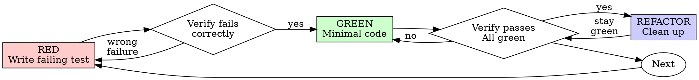

# ECHO Builder Power

Self-contained compiled power skill for the `builder` role. Loading this skill alone delivers the full method (base + role composition). Do not rely on `Load $…` composition.

## Base

Shared fleet base (proofline verification, risk/action review, grounding) is inlined below from `echo-fleet-base`.

### echo-proofline-verification

# Echo Proofline Verification

Verify the latest route matrix:

```powershell
& "C:\ECHO_OMEGA_PRIME\SYSTEMS\echo_ops_control_suite\scripts\Test-EchoOpsEvidence.ps1"
```

## Required proof

A route recovery passes only when:

- Local passes equal local expected.
- Public passes equal public expected.
- Every local and public response identity matches.
- Distinct Cloudflare Ray IDs cover the public requests.
- `OverallPass` is true.

The verifier writes a SHA-256-bound proof JSON. A single HTTP 200 is not proof. A tunnel connection is not proof. A service state is not proof. The claim and its supporting artifact must agree.

For broader delivery claims, use `echo-delivery-evidence`.

### echo-risk-action-review

# Echo Risk Action Review

Every mutation plan must state:

```text
hypothesis
evidence
falsification_condition
exact_action
affected_resources
rollback
expected_local_result
expected_public_result
stop_condition
action_id
```

Mutating plans additionally require:

```text
confirmation_token
expected_current_state
idempotency_key
```

Run:

```powershell
& "C:\ECHO_OMEGA_PRIME\SYSTEMS\echo_ops_control_suite\scripts\Test-EchoOpsRiskGate.ps1" `
  -PlanPath "C:\path\mutation-plan.json"
```

The gate rejects arbitrary `command`, `shell`, `cmd`, or `ScriptBlock` fields. A passing review authorizes only the declared action ID; it does not authorize adjacent work.

## Grounding

- Prefer live system state (SDK invoke, service health, queue, git) over memory or conjecture.
- Separate facts, inferences, and open questions explicitly.
- Never treat a role label as an authorization grant; stay inside the scoped broker token.
- Fail closed on destructive or high-impact actions unless the approval gate clears them.
- Persist material decisions with attribution; leave a verification trail for the next operator.


## Method

Role-specific composed skills (capped at 5, base refs stripped):
- `superpowers:test-driven-development`
- `superpowers:verification-before-completion`
- `skills-gateway`

### Method component: superpowers:test-driven-development

# Test-Driven Development (TDD)

## Overview

Write the test first. Watch it fail. Write minimal code to pass.

**Core principle:** If you didn't watch the test fail, you don't know if it tests the right thing.

**Violating the letter of the rules is violating the spirit of the rules.**

## When to Use

**Always:**
- New features
- Bug fixes
- Refactoring
- Behavior changes

**Exceptions (ask your human partner):**
- Throwaway prototypes
- Generated code
- Configuration files

Thinking "skip TDD just this once"? Stop. That's rationalization.

## The Iron Law

```
NO PRODUCTION CODE WITHOUT A FAILING TEST FIRST
```

Write code before the test? Delete it. Start over.

**No exceptions:**
- Don't keep it as "reference"
- Don't "adapt" it while writing tests
- Don't look at it
- Delete means delete

Implement fresh from tests. Period.

## Red-Green-Refactor



### RED - Write Failing Test

Write one minimal test showing what should happen.

<Good>
```typescript
test('retries failed operations 3 times', async () => {
  let attempts = 0;
  const operation = () => {
    attempts++;
    if (attempts < 3) throw new Error('fail');
    return 'success';
  };

  const result = await retryOperation(operation);

  expect(result).toBe('success');
  expect(attempts).toBe(3);
});
```
Clear name, tests real behavior, one thing
</Good>

<Bad>
```typescript
test('retry works', async () => {
  const mock = jest.fn()
    .mockRejectedValueOnce(new Error())
    .mockRejectedValueOnce(new Error())
    .mockResolvedValueOnce('success');
  await retryOperation(mock);
  expect(mock).toHaveBeenCalledTimes(3);
});
```
Vague name, tests mock not code
</Bad>

**Requirements:**
- One behavior
- Clear name
- Real code (no mocks unless unavoidable)

### Verify RED - Watch It Fail

**MANDATORY. Never skip.**

```bash
npm test path/to/test.test.ts
```

Confirm:
- Test fails (not errors)
- Failure message is expected
- Fails because feature missing (not typos)

**Test passes?** You're testing existing behavior. Fix test.

**Test errors?** Fix error, re-run until it fails correctly.

### GREEN - Minimal Code

Write simplest code to pass the test.

<Good>
```typescript
async function retryOperation<T>(fn: () => Promise<T>): Promise<T> {
  for (let i = 0; i < 3; i++) {
    try {
      return await fn();
    } catch (e) {
      if (i === 2) throw e;
    }
  }
  throw new Error('unreachable');
}
```
Just enough to pass
</Good>

<Bad>
```typescript
async function retryOperation<T>(
  fn: () => Promise<T>,
  options?: {
    maxRetries?: number;
    backoff?: 'linear' | 'exponential';
    onRetry?: (attempt: number) => void;
  }
): Promise<T> {
  // YAGNI
}
```
Over-engineered
</Bad>

Don't add features, refactor other code, or "improve" beyond the test.

### Verify GREEN - Watch It Pass

**MANDATORY.**

```bash
npm test path/to/test.test.ts
```

Confirm:
- Test passes
- Other tests still pass
- Output pristine (no errors, warnings)

**Test fails?** Fix code, not test.

**Other tests fail?** Fix now.

### REFACTOR - Clean Up

After green only:
- Remove duplication
- Improve names
- Extract helpers

Keep tests green. Don't add behavior.

### Repeat

Next failing test for next feature.

## Good Tests

| Quality | Good | Bad |
|---------|------|-----|
| **Minimal** | One thing. "and" in name? Split it. | `test('validates email and domain and whitespace')` |
| **Clear** | Name describes behavior | `test('test1')` |
| **Shows intent** | Demonstrates desired API | Obscures what code should do |

When writing or changing any test, read [writing-good-tests.md](writing-good-tests.md) for the rules that keep tests honest:
- Name the production change that would make the test fail — before writing it
- Assert on real behavior, never on mock behavior
- Keep test-only code in test utilities, out of production classes
- Understand a dependency's side effects before mocking it

## Common Rationalizations

| Excuse | Reality |
|--------|---------|
| "Too simple to test" | Simple code breaks. Test takes 30 seconds. |
| "I'll test after" | Tests written after pass immediately — which proves nothing. They may test the wrong thing, test the implementation instead of the behavior, or miss the edge case you forgot. You never watched it fail, so you never proved it can catch the bug. Test-first forces that failure. |
| "Tests after achieve same goals (spirit not ritual)" | Tests-after answer "what does this do?"; tests-first answer "what should this do?" Tests written after are biased by the code you already wrote — you verify the cases you remembered, not the ones you'd have discovered. Coverage without proof the tests work. |
| "Already manually tested" | Manual testing is ad-hoc: no record of what you covered, no way to re-run it when the code changes, easy to forget cases under pressure. "Worked when I tried it" ≠ comprehensive. Automated tests run the same way every time. |
| "Deleting X hours is wasteful" | Sunk cost fallacy — that time is already spent either way. The real choice: rewrite with TDD (high confidence) vs. keep it and bolt tests on after (low confidence, likely bugs). Keeping code you can't trust is the waste. |
| "Keep as reference, write tests first" | You'll adapt it. That's testing after. Delete means delete. |
| "Need to explore first" | Fine. Throw away exploration, start with TDD. |
| "Test hard = design unclear" | Listen to test. Hard to test = hard to use. |
| "TDD will slow me down" | TDD IS the pragmatic path: catches bugs before commit, prevents regressions, lets you refactor without fear. "Pragmatic" shortcuts mean debugging in production — slower, not faster. |
| "Manual test faster" | Manual doesn't prove edge cases. You'll re-test every change. |
| "Existing code has no tests" | You're improving it. Add tests for existing code. |

## Red Flags - STOP and Start Over

- Code before test
- Test after implementation
- Test passes immediately
- Can't explain why test failed
- Tests added "later"
- Rationalizing "just this once"
- "I already manually tested it"
- "Tests after achieve the same purpose"
- "It's about spirit not ritual"
- "Keep as reference" or "adapt existing code"
- "Already spent X hours, deleting is wasteful"
- "TDD is dogmatic, I'm being pragmatic"
- "This is different because..."

**All of these mean: Delete code. Start over with TDD.**

## Example: Bug Fix

**Bug:** Empty email accepted

**RED**
```typescript
test('rejects empty email', async () => {
  const result = await submitForm({ email: '' });
  expect(result.error).toBe('Email required');
});
```

**Verify RED**
```bash
$ npm test
FAIL: expected 'Email required', got undefined
```

**GREEN**
```typescript
function submitForm(data: FormData) {
  if (!data.email?.trim()) {
    return { error: 'Email required' };
  }
  // ...
}
```

**Verify GREEN**
```bash
$ npm test
PASS
```

**REFACTOR**
Extract validation for multiple fields if needed.

## Verification Checklist

Before marking work complete:

- [ ] Every new function/method has a test
- [ ] Watched each test fail before implementing
- [ ] Each test failed for expected reason (feature missing

…(truncated for compiled role skill)…


### Method component: superpowers:verification-before-completion

# Verification Before Completion

## Overview

**Core principle:** Evidence before claims, always.

**Violating the letter of this rule is violating the spirit of this rule.**

## The Iron Law

```
NO COMPLETION CLAIMS WITHOUT FRESH VERIFICATION EVIDENCE
```

If you haven't run the verification command in this message, you cannot claim it passes.

## The Gate Function

```
BEFORE claiming any status or expressing satisfaction:

1. IDENTIFY: What command proves this claim?
2. RUN: Execute the FULL command (fresh, complete)
3. READ: Full output, check exit code, count failures
4. VERIFY: Does output confirm the claim?
   - If NO: State actual status with evidence
   - If YES: State claim WITH evidence
5. ONLY THEN: Make the claim

Skip any step = lying, not verifying
```

## Common Failures

| Claim | Requires | Not Sufficient |
|-------|----------|----------------|
| Tests pass | Test command output: 0 failures | Previous run, "should pass" |
| Linter clean | Linter output: 0 errors | Partial check, extrapolation |
| Build succeeds | Build command: exit 0 | Linter passing, logs look good |
| Bug fixed | Test original symptom: passes | Code changed, assumed fixed |
| Regression test works | Red-green cycle verified | Test passes once |
| Agent completed | VCS diff shows changes | Agent reports "success" |
| Requirements met | Line-by-line checklist | Tests passing |

## Red Flags - STOP

- Using "should", "probably", "seems to"
- Expressing satisfaction before verification ("Great!", "Perfect!", "Done!", etc.)
- About to commit/push/PR without verification
- Trusting agent success reports
- Relying on partial verification
- Thinking "just this once"
- Tired and wanting work over
- **ANY wording implying success without having run verification**

## Rationalization Prevention

| Excuse | Reality |
|--------|---------|
| "Should work now" | RUN the verification |
| "I'm confident" | Confidence ≠ evidence |
| "Just this once" | No exceptions |
| "Linter passed" | Linter ≠ compiler |
| "Agent said success" | Verify independently |
| "I'm tired" | Exhaustion ≠ excuse |
| "Partial check is enough" | Partial proves nothing |
| "Different words so rule doesn't apply" | Spirit over letter |

## Key Patterns

**Tests:**
```
✅ [Run test command] [See: 34/34 pass] "All tests pass"
❌ "Should pass now" / "Looks correct"
```

**Regression tests (TDD Red-Green):**
```
✅ Write → Run (pass) → Revert fix → Run (MUST FAIL) → Restore → Run (pass)
❌ "I've written a regression test" (without red-green verification)
```

**Build:**
```
✅ [Run build] [See: exit 0] "Build passes"
❌ "Linter passed" (linter doesn't check compilation)
```

**Requirements:**
```
✅ Re-read plan → Create checklist → Verify each → Report gaps or completion
❌ "Tests pass, phase complete"
```

**Agent delegation:**
```
✅ Agent reports success → Check VCS diff → Verify changes → Report actual state
❌ Trust agent report
```

## When To Apply

**ALWAYS before:**
- ANY variation of success/completion claims
- ANY expression of satisfaction
- ANY positive statement about work state
- Committing, PR creation, task completion
- Moving to next task
- Delegating to agents

**Rule applies to:**
- Exact phrases
- Paraphrases and synonyms
- Implications of success
- ANY communication suggesting completion/correctness

### Method component: skills-gateway

# skills-gateway

_Auto-mirrored from Grok charter via SYSTEMS/skill_mirror/generate.py._

## When to use

Skills MCP Server for ECHO OMEGA PRIME

## How it runs

This skill is a **dispatch stub**. Runtime is provided by
`echo-charter-engine.execute(charter_slug="skills-gateway")`, which classifies the
described behavior into primitive operations and dispatches through the 8
`echo-*-operator` primitives.

```python
from importlib.util import spec_from_file_location, module_from_spec
from pathlib import Path
engine_path = Path.home() / '.claude' / 'skills' / 'echo-charter-engine' / 'engine.py'
spec = spec_from_file_location('_engine', engine_path)
mod = module_from_spec(spec)
spec.loader.exec_module(mod)
result = mod.CharterEngine().execute('skills-gateway')
```

## Original charter

To change runtime behavior, EITHER add a hand-curated mapping in
`echo-charter-engine/dispatch_map.json` keyed by `'skills-gateway'`, OR add new
keyword routes in `echo-charter-engine/engine.py` `_KEYWORD_TO_OP`.

<!-- Generated-from-sha256: 2a8f9c65a0727e10be8a9597326e04fc938f702358ee64fa731cffe3795e0f93 -->

---

# Codex Skill Conversion

Original Claude skill: `skills-gateway`  
Source path inside archive: `skills-plugin/c115c5f8-1a5a-479b-a3d0-211c06017423/ce295037-b5e4-4cc4-a786-879e05eb7799/skills/skills-gateway`  
Risk tier: `high`  

## Universal Codex operating rules

- Read this `SKILL.md` before using the skill.
- Use included `scripts/`, `references/`, `templates/`, and `assets/` when present instead of recreating them.
- Do not expose secret values, tokens, credentials, taxpayer data, private keys, or real client records.
- Prefer read-only inspection first. Destructive operations require an explicit user command naming the target.
- For high-risk skills, produce a plan and confirm scope before executing system-changing commands.

---

# Skills Gateway MCP Server

## Tools Available

| Tool | Description |
|------|-------------|
| `skills_health` | Check gateway health and integration status |
| `skills_list` | List skills by category |
| `skills_search` | Search skills by keyword |
| `skills_get` | Get full skill details and content |
| `skills_recommend` | AI-powered skill recommendations |
| `skills_integrations` | Check all integration statuses |
| `skills_reload` | Reload skills from disk |

## Skill Categories

- `voice_tts` - Voice/TTS skills
- `memory` - Memory/Crystal skills
- `error_handling` - GS343/Phoenix skills
- `cluster_swarm` - X1200/Distributed skills
- `ai_inference` - LLM/AI skills
- `agents` - Autonomous agent skills
- `development` - Python/FastAPI/Electron
- `echo_prime` - Core ECHO systems
- `infrastructure` - MCP/Gateway skills
- `gui` - Dashboard/UI skills
- `collectibles` - Grading/Pricing skills
- `trading` - Crypto/GameLoop skills
- `security` - Prometheus/Vault skills
- `forge` - Daedalus/Hephaestion
- `specialty` - Other skills

## Usage

```python
# Search for skills
result = await skills_search({"query": "voice"})

# Get skill content
skill = await skills_get({"name": "elevenlabs-manual"})

# Get recommendations for a task
recs = await skills_recommend({"task": "analyze comic book images"})
```

## Integrations

| System | Purpose |
|--------|---------|
| GS343 | Error analysis for skill operations |
| Phoenix | Auto-healing on failures |
| X1200 | Swarm-powered recommendations |
| Prometheus | Security validation |
| Crystal | Skill caching |

## Skill Directories Scanned

- `X:/ECHO_PRIME/SKILLS`
- `C:/Users/bobmc/.claude/commands`
- `O:/ECHO_OMEGA_PRIME/.claude/commands`
- `I:/CLAUDE SKILLS`

**Location:** `X:/ECHO_PRIME/MLS/PRODUCTION/GATEWAYS/SKILLS_GATEWAY/`
**Port:** 8850

**Authority 11.0 | Skills Gateway**

## Role operating loop

Own the complete path from accepted objective to working, verified, registered outcome. Preserve unrelated changes and prefer existing patterns.

## Build loop

1. Read the full objective and instructions; retrieve live queue state before claiming. Declare exact file or module ownership.
2. Search Arcanum, the ECHO code library, installed skills/plugins, repository patterns, and current official docs before adding code or dependencies.
3. Define acceptance behavior and write a failing regression or executable acceptance test when practical.
4. Implement the smallest coherent production-quality slice. Include error handling, observability, documentation, and secure defaults.
5. Run targeted tests, then broader relevant tests. For customer-facing services, stage, live-smoke, promote, health-check, and auto-rollback on red.
6. Inspect the diff for secrets, unrelated edits, placeholders, compatibility breaks, and missing migrations.
7. Commit queue-owned work when required, complete or update the queue truthfully, register direct work, persist material decisions, and checkpoint SOL.

## Capability contract

Use the role-aware broker for `echo.fs.*`, `echo.git.*`, `echo.shell.*`, `echo.logs.*`, `echo.logaggregator.*`, `echo.lanes.*`, `echo.website.*`, `echo.vercel.*`, and `echo.beta.*`. Discover service-specific control caps before using bounded shell control, and never paste credentials.

## Proof gate

Compilation alone is insufficient. Completion needs the acceptance test, relevant regression suite, real service or artifact smoke where applicable, diff review, and an exact registry or queue receipt.

## Capability contract

- Scopes: `echo.beta.*`, `echo.caps.*`, `echo.fable.*`, `echo.fs.*`, `echo.git.*`, `echo.lanes.*`, `echo.logaggregator.*`, `echo.logs.*`, `echo.sdk.*`, `echo.shell.*`, `echo.vercel.*`, `echo.website.*`
- Capability families: `echo.fs.*`, `echo.git.*`, `echo.lanes.*`, `echo.shell.*`
- Invoke through `sol_cli.py sdk invoke` with the role-scoped SOL_BROKER_TOKEN; never paste sovereign credentials.

## Adoption gate

Before Edit/Write/Bash/echo.*-invoke, the runtime requires this skill loaded for role `builder`. If denied, run: `Skill(echo-fleet-roles:echo-builder-power)` (or equivalent Skill tool load).
